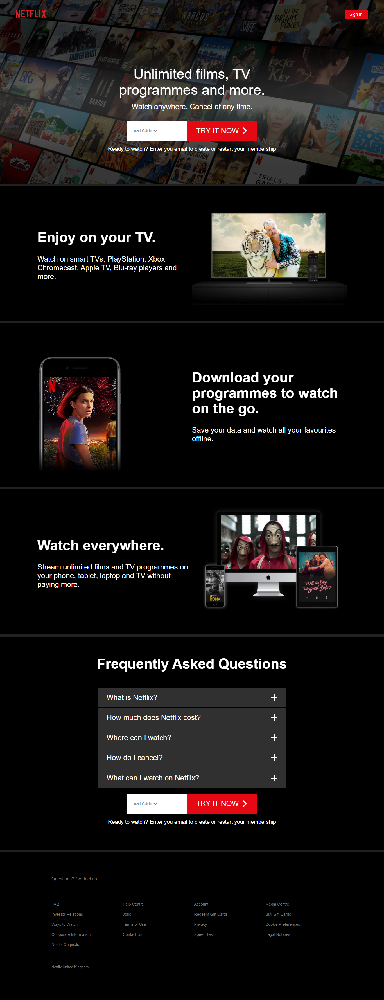
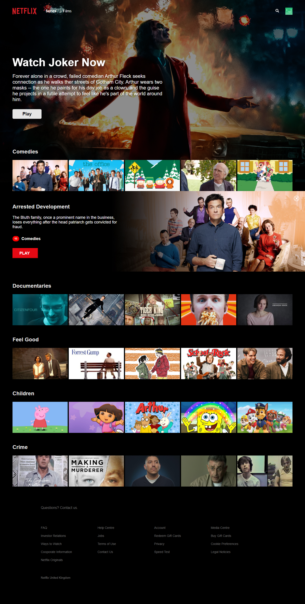
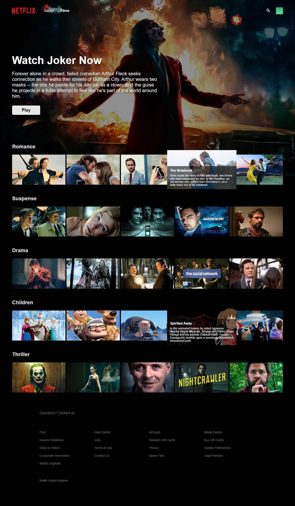
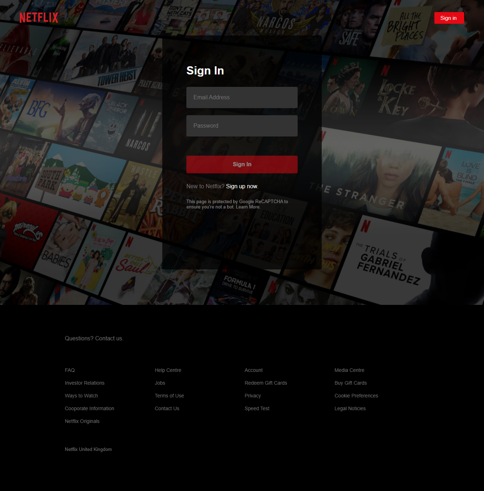

<h1 align="center">Netflix Clone</h1>
<div align="right">
    <a href="https://github.com/ItaloPussi/Netflix-Clone/blob/master/readme.pt.md" />Versão em Português</a>
</div>


<h1 align="center">
  
</h1>

<p>🚀 In this repo you'll find a Netflix clone made with React and Firebase.</p>

<p align="center">
 <a href="#project">Project</a> •
 <a href="#technologys">Techonologys</a> • 
 <a href="#contributing">Contributing</a> • 
 <a href="#credits">Credits</a> • 
 <a href="#license">Licence</a>
</p>

<h2 id="project">Project</h2>

<div>
  
  
  
  
 </div>


<p> To test the application it is necessary to have a <a href="https://firebase.google.com/" target="_blank">Firebase</a> application and <a href="https://nodejs.org/en/download/ target="_blank">NodeJs</a> installed.</p>
<p>After you've instaled firebase, create a .env file in root of the project and insert FirebaseConfig related variables:</p>

```
REACT_APP_API_KEY=xxxxxxxxxxxx
REACT_APP_AUTH_DOMAIN=xxxxxxxxxxxx
REACT_APP_PROJECT_ID=xxxxxxxxxxxx
REACT_APP_STORAGE_BUCKET=xxxxxxxxxxxx
REACT_APP_MESSAGING_SENDER_ID=xxxxxxxxxxxx
REACT_APP_ID=xxxxxxxxxxxx
```

<p> Now, follow these steps:</p>

```bash
  # Clone this repo
  git clone https://github.com/ItaloPussi/Netflix-Clone/
  
  # Navigate to the project folder
  cd Netflix-Clone
  
  # Install dependecies
  npm install
  
  # Start the aplication
  npm start
 ```
 
<h2 id="technologys">Tecnologys</h2>

<ul>
  <li>React</li>
  <li>Styled Components</li>
  <li>FuseJs</li>
  <li>React Router Dom</li>
  <li>Normalize CSS</li>
  <li>Firebase (Firestorage, FireAuth)</li>
</ul>

<h2 id="contributing">Contributing</h2>
<p>Found some bug or have an interesting contribution? Fell free to contribute!</p>

<h2 id="credits">Credits</h2>
<p>The base of this project is avaliable on <a href="https://www.youtube.com/watch?v=x_EEwGe-a9o" target="_blank">Karl Hadwen</a> channel.</p>

<h2 id="licence">Licence</h2>
<a href="https://choosealicense.com/licenses/mit/" target="_blank" />MIT</a>

